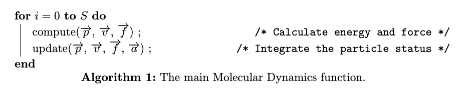
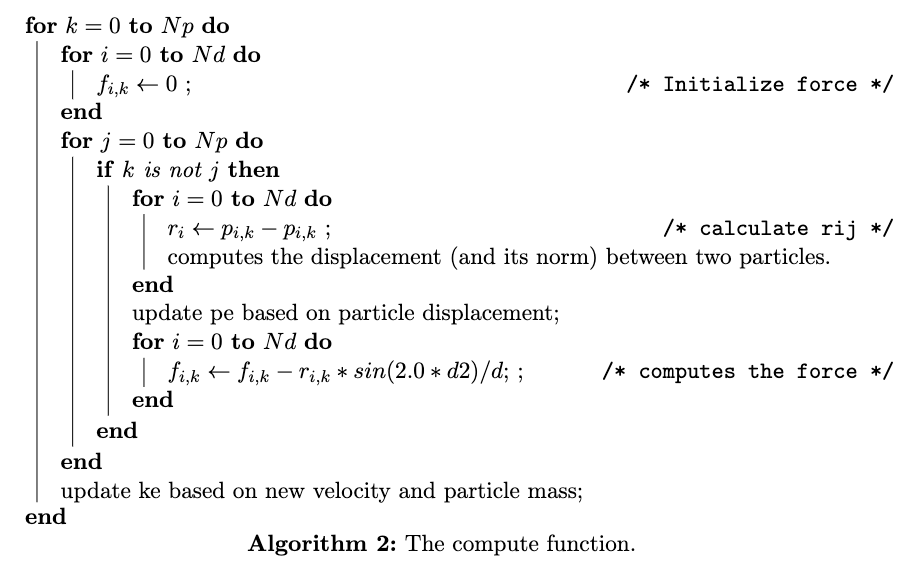
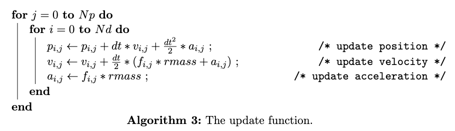

# 
Final Report

TzuKao Wang (A59010714)

Jack Sun (A16062902)

Zhengtong Zhang (A59011254)

## Section 1 Introduction
Molecular dynamics is a kind of simulation method to analyze atoms and
molecules’s physical movements.When given the original position and the velocity of
the particles, we could use many-body Newton functions to predict the particles
movement in the future and hence simulate the whole process of the system.

Since we could consider the system would become an ergodic system in the long term, the computation of each particles’ movement could be processed in the parallel approach. Thus we use OpenMP as the parallel computation method to assist the simulation of molecular dynamics. We will test the parallel program and develop the performance model based on the parameter of processors, the number of particles and the process time from computation and communcation. For further comparison, we will also utilizz OpenMC and Cuda method as other parallel technique for this program. 

## Section 2 Technique Appraoch
Our general purpose is to implement C code which carries out a molecular dynamics simulation, using OpenMP, OpenAcc and Cuda separately for parallel execution. OpenMP takes a more generic approach compared to OpenACC and Cuda, it allows programmers to explicitly spread the execution of loops, code regions and tasks across teams of threads. OpenACC and Cuda use directives to tell the compiler where to parallelize loops, and how to manage data between host and accelerator memories. 

The system includes Np interacting particles, e.g. atoms, molecules, Hydrogen, Helium, Lithium, Carbon and Oxygen. Our model simulates their motion and detects their reactions. The following are some physics formulas we used to calculate the forces between the particles and the energy. 

Forces of Particle i: 
$\vec{f_{i}}=m_{i} \vec{a}_{i}=-\nabla_{i} U(t)$

Potential Energy:
$U(t)=\frac{1}{2} \sum_{\substack{i=1}}^{N} \sum_{\substack{j=1 \\ j \neq i}}^{N} U_{i, j}\left(\left\|\vec{r}_{i, j}\right\|\right)$

Kinetic Energy:
$E_k = \frac{1}{2}mv^2$

Next, let's have an overview of the main Molecular Dynamics routine. In the main function, we set a constant step of the iterations for the system simulation (S is the total step of the computation). In each step, there are two function calls, compute and update. The compute function calculates the potential, kinetic energy and force of each particle. And the update function renewals the position, velocity and acceleration of each particle after the computation. 

The the compute function, Nd is the number of spatial dimensions and Np is the number of particles. The compute function has a complexity of $O({Np}^2)$. 

The potential function V(X) is a harmonic well which smoothly saturates to a maximum value at PI/2: 

$v(x) = {( sin ( min ( x, PI2 ) ) )}^2$ 

The derivative of the potential is: 

$dv(x) = 2.0 * sin ( min ( x, PI2 ) ) * cos ( min ( x, PI2 ) ) = sin ( 2.0 * min ( x, PI2 ) )$

The parallelization is implemented of computation of forces and energies.

In the update function, a velocity Verlet algorithm is used for the updating.

$p(t+dt) = p(t) + v(t) * dt + 0.5 * a(t) * dt * dt$

$v(t+dt) = v(t) + 0.5 * ( a(t) + a(t+dt) ) * dt$

$a(t+dt) = f(t) / m$

The time integration is fully parallel.

## Section 3 Developing Process
We will describe the developing process for each parallelize method, including the chanllenges and the notion we made during developing.

### 3.1 OpenMP
Since the OpenMP code is given [1](https://people.sc.fsu.edu/~jburkardt/cpp_src/md_openmp), the developing process we discuss here follows the comments in the given source code. 

The implementation of the molecular dynamics simulation is in the main function. The program uses OpenMP directives to allow parallel computation. The velocity Verlet time integration scheme is used. The particles interact with a central pair potential. After initializing the dimensions of the box, setting initial positions, velocities, and accelerations, we compute the forces and energies for the initial state. Then inside an iteration loop we set a total step and repeat the computation and update process several times. At the end we report the execution time. 

The parallelision parts are mainly implemented in the $\mathbf{compute}$ function and the $\mathbf{update}$ function. We used "# pragma omp parallel" to declare shared and private variables and arrays in the parallelism process, and "# pragma omp for" to parallelize the for loop. And in the compute function, we used "reduction" clause to accumulate the kinetic and potential encery results. 
### 3.2 OpenACC
Since OpenACC is much similar to OpenMP, its developing process could refer to the OpenMp version. Even though we successfully finished the OpenACC version, we faced a couple obstacles throughout implementing those methods. 

For the $\mathbf{compute}$ function , the situation is complex but we still could handle it. 

We first tried to use the kernel to construct and parallelize the entire nested loop (#pragma acc kernels). The kernels construct identifies the given region of code that may contain parallelism and relies on the automatic parallelization capabilities of the compiler to analyze the region. Unfortunately, the complier thinks that the nested loops are not safe to parallelize, so it refused to accelerate those loops. Thus, for this naive implementation, the inner loops failed to be parallelized because loop-carried dependencies were detected by the compiler. 

After considering the complaints by the compiler, we noticed that there are more instructions we need to give to the compiler. When we look at potential and kinetics, we are doing the combination. Thus, we could use the reduction. Furthermore, for other computation we found the rij(distance for different particle) and degree could be used privately. Based on these observations, we switched to using the parallel construct method provided by OpenACC (#pragma acc parallel loop). The parallel construct identifies a region of code that will be parallelized across OpenACC gangs. By itself, a parallel region is of limited use, but when paired with the loop directive, reduction and private clause, the compiler will generate a parallel version of the loop for the accelerator based on the given instruction. By placing this directive on a loop we programmer asserts that the affected loop is safe to parallelize and allows the compiler to select how to schedule the loop iterations on the target accelerator. 

With the above changes, we successfully parallelized the inner loops. However, all the arrays are reallocated in every iteration. Thus, we further modified the routine with an OpenACC data region before jumping into the calculation loop. We used the "copyin" instruction to create space for the variabels on the GPU device, and initialize the variables by copying data to the device at the beginning of the region. For variables like potential energy, kinetic energy and array like forces, we used the "copy" instruction to not only pass them to the device but also copy the results back to the host at the end of the region, and finally release the space on the device when done.

For the $\mathbf{update}$, same as the compute function with the naive kernel implementation, the compiler outputs errors about complex variable dependencies in the loop. Thus, based on the previous implementation experience on compute function, we end up using parallel construct method to parallelize the update loop. We use the "copy" instruction to send position, acceleration and velocity arrays to the device and get them back to the host when finished. And for the force matrix, we just need to be sent to device without sending back using the "copyin" instruction in this case. 
### 3.3 CUDA
From my observation, there are two part we need to do the parallelization which first part is $\mathbf{compute}$ function and the other is $\mathbf{update}$ part.

The later one is much easy since there is not data dependecy in this function and thus we could assign the thread to complete their tasks without waiting and communication with other threads.

But the first part is not such stright forward. There are three level for loops and many sub for loops in this function. It is hard for us to spilt to each thread. But we know that in many situation, the best approach to achieve serial method may not be also a good method when doing the parallelization. I observer that we could reorganized function and then it will be easy parallelization for CUDA method. I would use md_openmp.c document as the reference to describe how I reorganize the function in the following

At first, we could observer that the initialization from line 269-272 will occur once for each element in force array. The program from 302-305 has similar situation. For initialization, we could use $\mathbf{cudamemset}$ before this program starts. For the later part, the array $\mathbf{vel}$ and the value $\mathbf{ke}$ has no depency with above function. Thus, we could divide then into two different part one is doing above and the other does the ke computation. The parallelization for above part is still hard, but is much easier now.

In the remaining unparallelized program, we found that we could swith k and j now. After switching, we could do the parallelization under the for loop of j and we just need to do an extra reduction add to sum the result in this loop and then it could be paralleliazation.

## Section 4 Performance Model

### 4.1 OpenMP

### 4.2 OpenACC

### 4.3 CUDA

## Section 5 Conclusion

## Section 6 Future work 
For CUDA, we may use some method to parallelized the j loop. But this need more syncronization problem. Besides, the reduction could be optimized more. BUt due to time limitation, we would left it in the next step for our project.

For OpenAcc version, we will try to reduce the action for sent the data from fots to device and back. We believe it could optimized our result in the future.

## Reference
[1] John burkardt. (n.d.). Md_openmp.
https://people.sc.fsu.edu/~jburkardt/cpp_src/md_openmp

[2] OpenACC Programming and Best Practices Guide.
https://www.openacc.org/sites/default/files/inline-files/OpenACC_Programming_Guide_0.pdf
